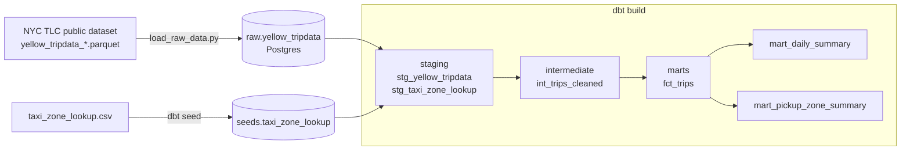

# NYC Taxi dbt Transformation Project

A modular, tested SQL transformation layer for NYC Yellow Taxi trip data,
built with dbt. Companion project to
[batch-etl-pipeline](../batch-etl-pipeline) — same dataset, same business
rules, but transformed with dbt/SQL (ELT) instead of pandas/Airflow (ETL), to
show both patterns.

| batch-etl-pipeline (ETL) | This project (ELT) |
|---|---|
| Raw file cleaned in Python before loading | Raw file loaded as-is; dbt cleans it in SQL |
| Redshift stand-in: Postgres | Snowflake/BigQuery stand-in: Postgres |
| Orchestrated by Airflow | Orchestrated by `dbt build` (+ CI on push) |

## Architecture



**Layers** (`dbt_project/models/`):

- **staging** — 1:1 with the source, just renamed/typed columns and a
  surrogate key (`dbt_utils.generate_surrogate_key`). Row count matches raw
  exactly; no filtering.
- **intermediate** (`int_trips_cleaned`) — dedupes, drops nulls, filters
  invalid trips (non-positive fare/distance, unrealistic passenger counts or
  durations), derives `trip_duration_minutes`. Same validity rules as the
  pandas version in `batch-etl-pipeline`, expressed in SQL.
- **marts** — `fct_trips` (grain: one row per trip, enriched with pickup/
  dropoff borough & zone names) and two aggregates built on top of it,
  `mart_daily_summary` and `mart_pickup_zone_summary`.

`taxi_zone_lookup.csv` is loaded as a **dbt seed** — small, static reference
data checked straight into the repo, the standard use case for seeds.

## Running it

Requires Docker Desktop (for a local Postgres) and Python.

```bash
cp .env.example .env
docker compose up -d
pip install -r requirements-dev.txt

python scripts/load_raw_data.py          # lands raw.yellow_tripdata

cp dbt_project/profiles.yml.example dbt_project/profiles.yml   # fill in from .env
cd dbt_project
dbt deps
dbt seed
dbt run
dbt test
```

Explore the docs site:

```bash
dbt docs generate
dbt docs serve
```

## Tests

- **Schema tests** (`schema.yml` files throughout `models/`): `unique` /
  `not_null` on primary keys, `relationships` from trips to the zone lookup.
- **Singular test** (`tests/assert_no_negative_amounts.sql`): regression
  guard asserting no trip in the mart ever has a negative fare or total.

Runs automatically on push via [GitHub Actions](.github/workflows/dbt_ci.yml)
— spins up Postgres, loads a real month of data, runs `dbt build` and
`dbt test` in CI.

## Project layout

```
scripts/
  load_raw_data.py             # downloads TLC parquet, lands it unmodified in raw.yellow_tripdata
dbt_project/
  dbt_project.yml
  packages.yml                  # dbt_utils
  profiles.yml.example
  seeds/
    taxi_zone_lookup.csv          # NYC TLC zone reference data
  models/
    staging/                       # sources.yml, stg_yellow_tripdata, stg_taxi_zone_lookup
    intermediate/                    # int_trips_cleaned
    marts/                             # fct_trips, mart_daily_summary, mart_pickup_zone_summary
  tests/
    assert_no_negative_amounts.sql
  macros/
    generate_schema_name.sql          # schema = folder name, no target-schema prefix
docker-compose.yml                       # single Postgres, standing in for Snowflake/BigQuery
```

## Resume line

> Built modular, tested data transformation models using dbt — staging,
> intermediate, and mart layers with schema and custom data tests — improving
> data reliability and documentation for NYC Yellow Taxi trip data.
